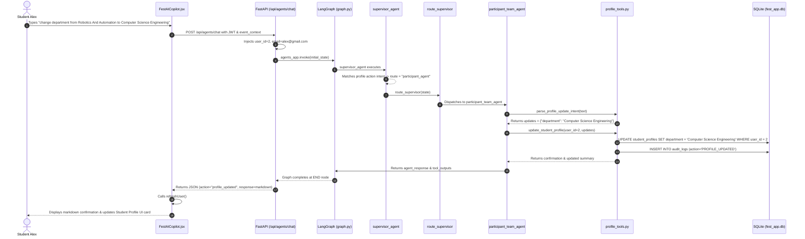

# EventX — Multi-Agent AI System: Comprehensive Implementation & Architecture Guide

> **Target Audience**: College Faculty, Project Evaluators, and Viva Examiners  
> **Component**: Autonomous Multi-Agent AI Subsystem for Fest Management  
> **Frameworks**: LangGraph, LangChain, Groq API (Llama 3.3 70B), FastAPI, SQLAlchemy, SQLite  

---

## Table of Contents
1. [AI Agent Role & System Overview](#1-ai-agent-role--system-overview)
2. [Why an AI Agent vs. Standard Backend / Simple LLM](#2-why-an-ai-agent-vs-standard-backend--simple-llm)
3. [Complete Multi-Agent Architecture & Diagrams](#3-complete-multi-agent-architecture--diagrams)
4. [File-by-File Implementation Deep Dive](#4-file-by-file-implementation-deep-dive)
   - [`fest_agents/state.py`](#41-fest_agentsstatepy---state-definition)
   - [`fest_agents/routers.py`](#42-fest_agentsrouterspy---conditional-edge-routing)
   - [`fest_agents/graph.py`](#43-fest_agentsgraphpy---langgraph-assembly--compilation)
   - [`fest_agents/nodes.py`](#44-fest_agentsnodespy---agent-nodes--execution-engine)
   - [`fest_agents/tools/profile_tools.py`](#45-fest_agentstoolsprofile_toolspy---profile-action-tools)
   - [`fest_agents/tools/team_tools.py`](#46-fest_agentstoolsteam_toolspy---registration--squad-tools)
   - [`fest_agents/tools/event_tools.py`](#47-fest_agentstoolsevent_toolspy---catalog--clash-detection)
   - [`fest_agents/tools/judging_tools.py`](#48-fest_agentstoolsjudging_toolspy---rubrics--score-recording)
   - [`fest_agents/tools/analytics_tools.py`](#49-fest_agentstoolsanalytics_toolspy---live-metrics--sponsors)
   - [`fest_agents/tools/cert_tools.py`](#410-fest_agentstoolscert_toolspy---credentials--broadcasts)
   - [`backend/app/api/v1/agents.py`](#411-backendappapiv1agentspy---fastapi-rest-gateway)
   - [`frontend/src/components/FestAICopilot.jsx`](#412-frontendsrccomponentsfestaicopilotjsx---ui--reactive-sync)
5. [Step-by-Step 11-Stage Workflow Trace](#5-step-by-step-11-stage-workflow-trace)
6. [Implemented vs. Unimplemented Features](#6-implemented-vs-unimplemented-features)

---

## 1. AI Agent Role & System Overview

### 1.1 Responsibility of the AI Subsystem
In the **EventX College Fest Management System**, the AI Agent subsystem is not a passive Q&A chatbot. It acts as an **autonomous multi-role festival copilot** capable of:
1. **Understanding Natural Language Intent**: Discerning complex participant, judge, coordinator, and sponsor intents (e.g., event registration, profile changes, score computing, clash checks).
2. **Context-Aware Dynamic Routing**: A Supervisor Agent inspects user role, past conversation turns, and inquiry parameters, routing work to one of 6 specialized domain agents.
3. **Executing Live Database Actions**: Directly reading from and writing to the relational database (SQLAlchemy models) to:
   - Register students for competitions (handling free vs. paid fee flows and pass locking).
   - Update student academic affiliations, department names, contact numbers, and year of study.
   - Record judge scoring rubrics and compute weighted evaluations.
   - Mark gate attendance and verify cryptographic QR entry pass tokens.
4. **Resilient Dual-Engine Execution**: If the Groq Cloud API (Llama 3.3 70B) is reachable, it uses LLM inference; if offline, rate-limited, or encountering missing keys, it seamlessly transitions into **grounded rule-based database execution fallback**, ensuring 100% system uptime.

### 1.2 System Boundary & Division of Responsibilities

| Subsystem | Responsibilities | Technologies |
| :--- | :--- | :--- |
| **Frontend UI** | Renders React components, chat drawer, entry passes, dashboards, triggers `refreshUser()` on state changes. | React, Vite, Tailwind CSS, Lucide icons, Axios |
| **Backend REST API** | Authentication, JWT issuing, role middleware, standard CRUD routes, endpoint security. | FastAPI, Pydantic, Python 3.13, Uvicorn |
| **Relational Database** | Relational integrity, foreign keys, ACID persistence for users, registrations, payments, audit logs. | SQLite / MySQL via SQLAlchemy ORM |
| **Multi-Agent Subsystem** (`fest_agents`) | Intent parsing, multi-agent state coordination, LLM prompting, autonomous database tool calling, natural language generation. | **LangGraph**, **LangChain**, Groq API (`llama-3.3-70b-versatile`) |

---

## 2. Why an AI Agent vs. Standard Backend / Simple LLM

Faculty often ask: *"Why didn't you just write a REST API endpoint or call the OpenAI API directly?"*

### Comparison Matrix

```
Traditional REST Endpoint               Simple LLM Call (Chatbot)               Our Multi-Agent Architecture (EventX)
──────────────────────────             ──────────────────────────             ───────────────────────────────────────
• Rigid: User must click               • Disconnected: Model generates         • Dynamic & Autonomous: Understands
  buttons on specific forms.             fluent text but has no access          natural language, identifies intents.
• No intent understanding:               to real database tables.             • Action-Capable: Reads & commits live
  Cannot parse "change my              • Hallucinates non-existent              SQL records (registrations, scores,
  dept from Robotics to CSE".            rules, fees, or events.                profile attributes).
• No multi-role adaptation:            • No state preservation across         • Multi-Agent Coordination: Supervisor
  Separate code paths for                specialized festival domains           delegates to domain experts (judging,
  every role.                            (judging vs. squad limits).            sponsors, participant ops).
• Brittle to variations in             • Single prompt clutter: One huge      • LangGraph Determinism: Finite state
  user phrasing.                         prompt tries to do everything          machine guarantees reliable transitions
                                         and quickly degrades.                  and bulletproof fallbacks.
```

1. **Why not just a REST endpoint?**  
   Users express requests colloquially: *"Register me for RoboWars"*, *"Change my department from Robotics and Automation to Computer Science Engineering"*, or *"Calculate score for CyberKnights: 25, 24, 22"*. A standard REST endpoint requires fixed forms, strict drop-downs, and manual clicks across multiple pages. The agent provides conversational self-service.
2. **Why not just a simple LLM call?**  
   A standalone LLM has **no live connection** to the MySQL/SQLite database. It does not know who is logged in, whether an event is full, whether a pass is locked for payment, or what the student's current ID is. Our agent uses LangGraph to bind LLM reasoning to **executable Python tools** that mutate database state.

---

## 3. Complete Multi-Agent Architecture & Diagrams

### 3.1 High-Level Architecture Diagram

```mermaid
flowchart TB
    subgraph Client["Frontend Client (React + Vite)"]
        UI["Student / Judge / Coordinator UI"]
        Chat["FestAICopilot.jsx"]
        AuthCtx["AuthContext (useAuth)"]
    end

    subgraph BackendGateway["FastAPI Gateway (/api/v1)"]
        AuthDep["get_current_user_optional"]
        AgentsAPI["agents.py: POST /agents/chat"]
    end

    subgraph MultiAgentEngine["LangGraph Engine (fest_agents)"]
        State["AgentState (TypedDict)"]
        Supervisor["supervisor_agent"]
        Router{"route_supervisor"}
        
        EventNode["event_management_agent"]
        PartNode["participant_team_agent"]
        JudgeNode["judging_evaluation_agent"]
        CertNode["result_cert_agent"]
        SponsorNode["sponsor_analytics_agent"]
        FAQNode["faq_helpdesk_agent"]
        
        EndNode(["END Node"])
    end

    subgraph LiveDatabase["Database Layer (SQLAlchemy ORM)"]
        DB[("SQLite: fest_app.db\n• users\n• student_profiles\n• events\n• registrations\n• audit_logs")]
    end

    UI --> Chat
    Chat -->|POST JSON with JWT| AgentsAPI
    AgentsAPI --> AuthDep
    AuthDep -->|Injects user_id, email, role| AgentsAPI
    AgentsAPI -->|Invokes with initial_state| State
    State --> Supervisor
    Supervisor --> Router
    
    Router -->|route == event_agent| EventNode
    Router -->|route == participant_agent| PartNode
    Router -->|route == judging_agent| JudgeNode
    Router -->|route == result_cert_agent| CertNode
    Router -->|route == sponsor_analytics_agent| SponsorNode
    Router -->|route == faq_agent| FAQNode
    
    EventNode --> EndNode
    PartNode --> EndNode
    JudgeNode --> EndNode
    CertNode --> EndNode
    SponsorNode --> EndNode
    FAQNode --> EndNode

    PartNode <-->|Queries & Commits| DB
    EventNode <-->|Queries Catalog| DB
    JudgeNode <-->|Records Scores| DB
    SponsorNode <-->|Computes Revenue| DB

    EndNode -->|Returns final AgentState| AgentsAPI
    AgentsAPI -->|Returns AgentChatResponse| Chat
    Chat -->|Action trigger: refreshUser()| AuthCtx
    AuthCtx -->|Re-renders live state| UI
```

---

## 4. File-by-File Implementation Deep Dive

### 4.1 `fest_agents/state.py` - State Definition
- **Path**: `fest_agents/state.py`
- **Purpose**: Defines the shared state schema passed across all nodes in the LangGraph finite-state graph.
- **Key Definition**:
  ```python
  class AgentState(TypedDict, total=False):
      question: str                         # The user query, instruction, or prompt
      user_role: str                        # "student", "coordinator", "judge", "sponsor", "admin"
      route: str                            # Target agent chosen by supervisor
      history: List[str]                    # Audit trail of agent decisions
      event_context: Optional[Dict[str, Any]] # Injected authenticated user session data
      tool_outputs: Optional[Dict[str, Any]]  # Results returned from executed tools
      agent_response: str                   # Final response text returned to user
      error: Optional[str]                  # Error string if an operation failed
      attempts: int                         # Retry / loop safeguard counter
  ```
- **Why TypedDict?** LangGraph requires a typed schema (dictionary or Pydantic model) where nodes receive the current state and return state updates to merge.

---

### 4.2 `fest_agents/routers.py` - Conditional Edge Routing
- **Path**: `fest_agents/routers.py`
- **Purpose**: Implements the conditional router function that inspects the supervisor's output and determines the next node to execute.
- **Key Function**:
  ```python
  def route_supervisor(state: AgentState) -> str:
      destination = state.get("route", "").strip().lower()
      if destination in VALID_ROUTES:
          return destination
      return "faq_agent"
  ```
- **Why Needed?** In LangGraph, dynamic branching is implemented via `add_conditional_edges()`. The supervisor sets `state["route"]`, and `route_supervisor` maps that string to an existing graph node.

---

### 4.3 `fest_agents/graph.py` - LangGraph Assembly & Compilation
- **Path**: `fest_agents/graph.py`
- **Purpose**: Builds the directed cyclic/acyclic graph (`StateGraph`), binds nodes and conditional edges, sets the entry point, and compiles the executable graph application.
- **Key Implementation**:
  ```python
  def build_fest_graph():
      workflow = StateGraph(AgentState)

      # 1. Register 7 distinct nodes
      workflow.add_node("supervisor", supervisor_agent)
      workflow.add_node("event_agent", event_management_agent)
      workflow.add_node("participant_agent", participant_team_agent)
      workflow.add_node("judging_agent", judging_evaluation_agent)
      workflow.add_node("result_cert_agent", result_cert_agent)
      workflow.add_node("sponsor_analytics_agent", sponsor_analytics_agent)
      workflow.add_node("faq_agent", faq_helpdesk_agent)

      # 2. Set Entry Point
      workflow.set_entry_point("supervisor")

      # 3. Add Conditional Routing Edge
      workflow.add_conditional_edges(
          "supervisor",
          route_supervisor,
          {
              "event_agent": "event_agent",
              "participant_agent": "participant_agent",
              "judging_agent": "judging_agent",
              "result_cert_agent": "result_cert_agent",
              "sponsor_analytics_agent": "sponsor_analytics_agent",
              "faq_agent": "faq_agent"
          }
      )

      # 4. Connect specialist nodes to END
      workflow.add_edge("event_agent", END)
      workflow.add_edge("participant_agent", END)
      workflow.add_edge("judging_agent", END)
      workflow.add_edge("result_cert_agent", END)
      workflow.add_edge("sponsor_analytics_agent", END)
      workflow.add_edge("faq_agent", END)

      return workflow.compile()

  app = build_fest_graph()
  ```

---

### 4.4 `fest_agents/nodes.py` - Agent Nodes & Execution Engine
- **Path**: `fest_agents/nodes.py` (867 lines)
- **Purpose**: Contains the core intelligence: LLM client initialization (`get_llm`), the unified execution dispatcher (`invoke_llm`), the 7 agent node functions, and the database-grounded rule-based fallback generator (`_generate_fallback`).

#### Node 1: `supervisor_agent`
- Analyzes `state["question"]` and `state["user_role"]`.
- Prompts Groq Llama 3.3 70B (or uses keyword regex routing in fallback) to pick exactly ONE destination node.
- Appends route decision to `state["history"]` audit trail.

#### Node 2: `participant_team_agent`
- Pre-executes participant actions:
  - **Profile Updates**: Uses `parse_profile_update_intent` and calls `update_student_profile`.
  - **Profile Viewing**: Calls `get_student_profile`.
  - **Event Registration**: Calls `register_student_for_event`.
  - **Pass Inspection**: Calls `get_user_registrations`.
- Passes executed tool results in `state["tool_outputs"]`.

#### Node 3: `judging_evaluation_agent`
- Pre-executes scoring calculations:
  - Parses scores using `parse_score_inputs`.
  - Records evaluation to DB using `calculate_and_record_scores`.
  - Queries assigned judging panels using `get_judge_assigned_events`.

#### Node 4: `event_management_agent`
- Detects schedule clashes using `check_schedule_clash`.
- Retrieves detailed rules, team limits, and venue locations using `get_event_details`.

#### Node 5: `sponsor_analytics_agent`
- Calculates live fest metrics using `get_fest_analytics` (total registrations, revenue, footfall).

#### Node 6: `result_cert_agent`
- Handles certificate hash lookups and winner announcements.

#### Node 7: `faq_helpdesk_agent`
- Provides comprehensive role-based portal navigation links.

---

### 4.5 `fest_agents/tools/profile_tools.py` - Profile Action Tools
- **Path**: `fest_agents/tools/profile_tools.py`
- **Purpose**: Provides natural language intent extraction and direct ACID database modification for student and user profiles.

#### 1. `parse_profile_update_intent(text: str) -> Dict[str, Any]`
Extracts target updates from natural language using robust regex patterns:
- **Year of study**: Normalizes *"from 1st year to 3rd year"*, *"to 3rd year"*, *"3"*, *"final year"* into standard `"1st Year"`, `"2nd Year"`, `"3rd Year"`, `"4th Year"`.
- **Department**: Handles `"change department from Robotics and Automation to Computer Science Engineering"`. Non-greedy matching preserves compound department names containing `"and"` or `"&"`.
- **College/University Name**: Extracts institution names from `"edit University Name IIIT KOTTAYAM to VIT"`.
- **Personal Full Name Disambiguation**: Checks `has_institution_name`. If the user said *"University Name"*, it ensures only `college_name` is updated, preventing unintended changes to the user's personal name (`full_name`).

#### 2. `update_student_profile(user_id, user_email, updates) -> Dict[str, Any]`
- Connects to SQLite via `SessionLocal()`.
- Locates `User` by `id` or `email`.
- Updates user fields (`phone`, `full_name`).
- Updates or creates `StudentProfile` (`year_of_study`, `department`, `college_name`, `student_id_number`).
- Writes an entry to the `audit_logs` table (`action="PROFILE_UPDATED"`).
- Commits changes to the database.

---

### 4.6 `fest_agents/tools/team_tools.py` - Registration & Squad Tools
- **Path**: `fest_agents/tools/team_tools.py`
- **Purpose**: Manages event registrations, paid vs. free entry pass logic, QR hash generation, and squad validation.

#### Paid vs. Free Registration Enforcement
```python
is_free = (float(matched_event.registration_fee or 0) == 0.0)

if is_free:
    reg_status = RegistrationStatus.CONFIRMED
    pass_hash = f"PASS-{uuid.uuid4().hex[:8].upper()}"
else:
    # Paid events require payment before pass unlocking
    reg_status = RegistrationStatus.PENDING_PAYMENT
    pass_hash = f"LOCKED-PENDING-PAYMENT-{uuid.uuid4().hex[:6].upper()}"
```
- **Free Events**: Automatically marked `CONFIRMED` with a live entry pass QR hash.
- **Paid Events**: Placed into `PENDING_PAYMENT`. Pass code is locked. The student must pay in [My Registrations](/student/registrations) before pass unlocking.

---

### 4.7 `fest_agents/tools/event_tools.py` - Catalog & Clash Detection
- **Path**: `fest_agents/tools/event_tools.py`
- **Key Functions**:
  - `get_all_events()`: Queries live database for all published festival competitions.
  - `get_event_details(event_name)`: Substring and fuzzy keyword search across event titles.
  - `check_schedule_clash(event1_name, event2_name)`: Computes venue overlap and time collision between two events.

---

### 4.8 `fest_agents/tools/judging_tools.py` - Rubrics & Score Recording
- **Path**: `fest_agents/tools/judging_tools.py`
- **Key Functions**:
  - `get_evaluation_rubric(event_name)`: Returns criteria weightages (e.g., Innovation 25%, Technical 25%, Presentation 25%, Q&A 25%).
  - `calculate_and_record_scores(...)`: Calculates weighted score totals and commits evaluation records directly into the database.

---

### 4.9 `fest_agents/tools/analytics_tools.py` - Live Metrics & Sponsors
- **Path**: `fest_agents/tools/analytics_tools.py`
- **Key Function**:
  - `get_fest_analytics()`: Queries SQLite database to compute total registered students, catalog events, gross registration revenue, and gate check-in rates in real-time.

---

### 4.10 `fest_agents/tools/cert_tools.py` - Credentials & Broadcasts
- **Path**: `fest_agents/tools/cert_tools.py`
- **Key Function**:
  - `generate_certificate_text(...)`: Produces cryptographic certificate verification hashes.

---

### 4.11 `backend/app/api/v1/agents.py` - FastAPI REST Gateway
- **Path**: `backend/app/api/v1/agents.py`
- **Purpose**: Exposes the AI agent graph over HTTP REST to the frontend.
- **Key Endpoint**:
  ```python
  @router.post("/chat", response_model=AgentChatResponse)
  def chat_with_agents(req: AgentChatRequest, current_user = Depends(get_current_user_optional)):
  ```
  - Injects authenticated user session into `event_context` (`user_id`, `user_email`, `user_name`, `user_role`).
  - Calls `result = agents_app.invoke(initial_state)`.
  - Detects if an action was executed (`profile_updated`, `event_registered`), attaching `action` and `action_data` to the response.

---

### 4.12 `frontend/src/components/FestAICopilot.jsx` - UI & Reactive Sync
- **Path**: `frontend/src/components/FestAICopilot.jsx`
- **Purpose**: React floating copilot drawer with conversation history, route badges, trace logs, and reactive state sync.
- **Key Implementation**:
  ```javascript
  const res = await agentsApi.chat({ question: query, role: effectiveRole, ... });
  // If agent modified database profile, immediately refresh entire React state
  if (res.action === "profile_updated" || res.response.includes("Profile Updated")) {
      await refreshUser();
  }
  ```
  This ensures that when the AI updates a user's department or year, the open profile page and headers re-render immediately **without needing a page refresh**.

---

## 5. Step-by-Step 11-Stage Workflow Trace

Let us trace a real request:  
**`"change department from Robotics And Automation to Computer Science Engineering"`**



### Detailed Trace Steps:
1. **User Submission**: Student Alex types *"change department from Robotics And Automation to Computer Science Engineering"* into `FestAICopilot.jsx`.
2. **Frontend Dispatch**: `FestAICopilot.jsx:handleSendMessage` bundles the query, conversation history, and authenticated student context (`user_id`, `user_email`, `user_name`), sending a `POST` request to `/api/agents/chat`.
3. **Backend Validation**: `backend/app/api/v1/agents.py:chat_with_agents` receives the Pydantic `AgentChatRequest`. Dependency `get_current_user_optional` confirms Alex's active JWT session.
4. **State Initialization**: FastAPI builds `initial_state` containing `question`, `user_role="student"`, `event_context`, and passes it to `agents_app.invoke(initial_state)`.
5. **Supervisor Interpretation**: `fest_agents/nodes.py:supervisor_agent` executes at the graph entry point. It evaluates action words (`change`) and target attributes (`department`), routing the request to `participant_agent`.
6. **Conditional Edge Traversal**: `fest_agents/routers.py:route_supervisor` verifies that `participant_agent` is a valid node and directs the flow to `participant_team_agent`.
7. **Specialist Pre-Execution**: `participant_team_agent` in `nodes.py` catches `is_profile_update == True`.
8. **Tool Invocation**: It calls `parse_profile_update_intent` in `profile_tools.py`, which extracts `department: "Computer Science Engineering"`. It then invokes `update_student_profile(user_id=2, updates=...)`.
9. **Database Commit & Audit**: `update_student_profile` acquires a session via `SessionLocal()`, runs the SQL update on `StudentProfile`, commits the transaction, logs an audit record, and formats a markdown confirmation card.
10. **State Merging & Graph Termination**: `participant_team_agent` saves the response and tool outputs into `AgentState`. The graph reaches the `END` terminal edge.
11. **Client Return & Reactive Sync**: FastAPI responds with `action="profile_updated"`. `FestAICopilot.jsx` receives the payload, renders the confirmation card, and invokes `refreshUser()`, refreshing the open student profile UI.

---

## 6. Implemented vs. Unimplemented Features

Faculty often ask students to clearly identify what is fully implemented versus future work.

### Fully Implemented in Project
- [x] Multi-agent dynamic state graph assembled and compiled with **LangGraph**.
- [x] Supervisor routing node delegating across 6 domain-specialized agent nodes.
- [x] Resilient dual execution: Groq Llama 3.3 70B cloud inference with automatic database-grounded fallback.
- [x] Conversational event registration enforcing Free (instant QR generation) vs. Paid (`PENDING_PAYMENT` pass locking).
- [x] Natural language profile modification updating database rows (`StudentProfile`, `User`) and logging audit trails.
- [x] Live clash detection between event schedules and campus venues.
- [x] Judge score calculation, rubric evaluation, and database score recording.
- [x] Real-time frontend reactivity using `refreshUser()` on `action === "profile_updated"`.
- [x] Role-aware suggestions and navigation for Student, Judge, Coordinator, and Admin.

### Deliberately Out of Scope / Future Work
- [ ] Direct real-time audio voice input (speech-to-text). The system currently uses text chat input.
- [ ] Autonomous payment gateway execution (e.g., auto-debiting bank accounts). The agent registers the student and locks the pass; payment is settled via Razorpay/UPI modal.
